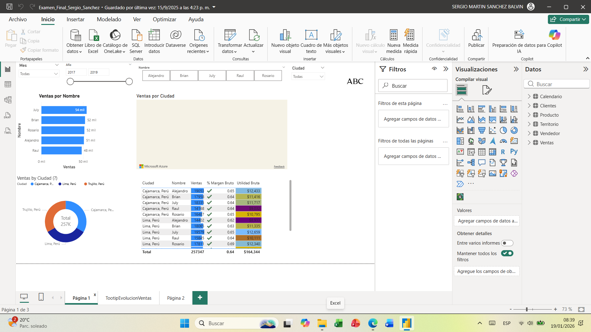

# Examen Final Power BI – Clase 6

Este repositorio contiene el proyecto final del curso de Power BI.  
Simula un caso de consultoría para la empresa **ABC**, donde se construyó un modelo de datos y dashboards interactivos para analizar clientes, productos, territorios y ventas.

## 🚀 Tecnologías utilizadas
- Power BI Desktop  
- Power Query  
- Lenguaje DAX  
- Excel  

## 📊 Resultados principales
- Medidas creadas: **Ventas, Costos, Utilidad Bruta, % Margen Bruto, Cantidad de Ventas**.  
- Visualizaciones: mapas, gráficos de barras, líneas, ring chart, tablas con formato condicional.  
- Uso de slicers y tooltips gráficos para mejorar la interacción.  

## 📷 Ejemplos de dashboards
*(Agrega aquí capturas de pantalla de tus reportes para que los reclutadores los vean sin abrir los archivos)*

## 📂 Cómo abrir el proyecto
1. Descargar los archivos `.pbix`.  
2. Abrirlos en **Power BI Desktop**.  
3. Los datos de ejemplo están en la carpeta `Data`.  

---

### 🎯 Nota personal
Este proyecto forma parte de mis **prácticas pre profesionales** y demuestra mis habilidades en:
- Modelado de datos  
- Creación de medidas DAX  
- Diseño de dashboards interactivos  
- Presentación clara de indicadores de negocio  

